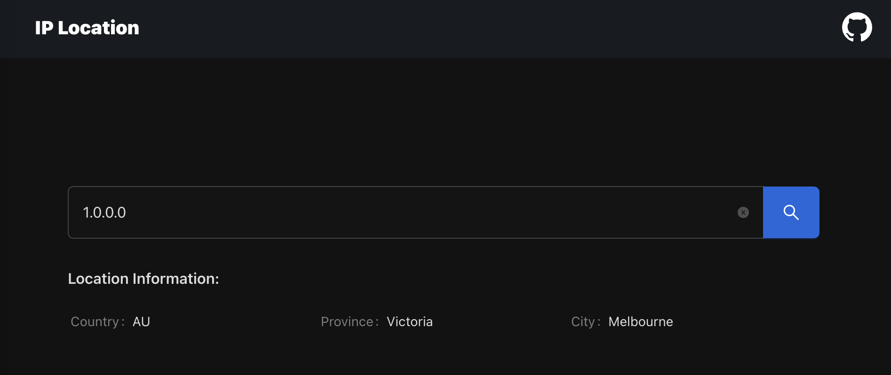

# location-rs

Get the location by ip address, it support ipv4 and ipv6.



`curl 'http://127.0.0.1:7001/api/ip-locations/1.0.132.192'`

## start

```bash
docker run -d --restart=always \
  -p 7001:7001 \
  --name=location \
  vicanso/location
```
